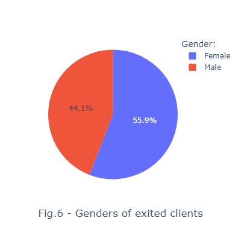
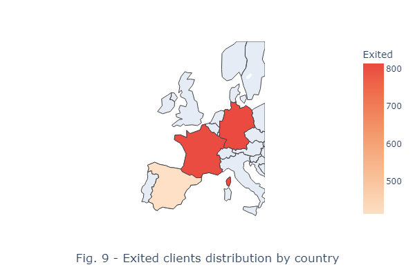
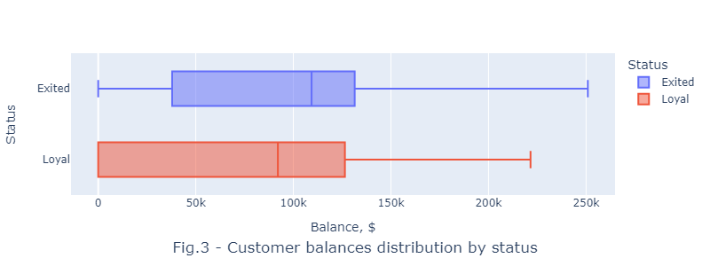

# Bank customers outflow
---

## Content

[1. Summary](README.md#Summary)   
[2. Data and methods](README.md#Data-and-methods)   
[3. Installation](README.md#Installation)    
[4. Project structure](README.md#Project-structure)


## Summary
It was predicted the client churn from a german bank using the ensemble machine learning model. Several models were compared and the Random Forest showed satisfactory results (F1-score=0.69). It was shown that the number of features could be reduced from 11 to 4 without severe decrease of predicting quality. Users may forecast the customer status by a given data using the microservice application in Streramlit which can be generated either online or on a local machine.

<p align="center"> 
 
</p>


## Data and methods
It is widely known that the retention of an existing client is cheaper than finding a new one. Thus, the client, an international bank, wants to predict whether the client is going to leave it or he is still loyal to the bank. If yes, a manager will offer some additional options to recover his loyalty to the company's services.

The assignment is narrowed to the binary classification: whether or not the client leaves the bank. The data was taken from the [Kaggle.com](https://www.kaggle.com/datasets/mathchi/churn-for-bank-customers) website.

Status disribution in the population on the fig.1 shows that almost 20% of clients was churned and the majority of these clients were women (fig.2).
<div align="center">
 
  </div>

Churned clients lived in 3 countries: Germany, France and Spain (fig.9). They didn't have the Active Client Status though they saved significanta sums on their accounts.

<div align="center">
 
  </div>

In order to identify the best model, several models were compared: 
* linear regression, 
* polynomial regression with L1 and L2 regularization, 
* decision tree 
* random forest

The random forest shows better result in comparison with that of other models. Furthermore, the best model hyperparameters were identified using Optuna library.

Analyzing the target feature it was found that its classes are not balanced. Taking this fact into account, it was decided to use F1-score metric since it provided a harmonic mean of two other metrics: precision and recall. The model's F1-score is 0.69 indicating that it has a good predictive quality which can be observed from the fig.16 below.

<div align="center"> 
  </div>

:arrow_up:[ to content](README.md#Content)


## Installation
Type in the console:
```Python
# 1. Clone repository and install requirements.
git clone https://github.com/Alex1iv/Bank_customers_outflow.git

# 2. install requirements
pip install -r -q requirements.txt

# 3. Run the application on a web page using main.py.
python main.py

# 4. When finished, press Ctrl + C in the console and close the web page.
```

:arrow_up:[ to content](README.md#Content)

## Project structure

<details>
  <summary>display project structure </summary>

```Python
Bank_customers_outflow
├── .gitignore
├── config              # configuration parameters
│   └── config.json     
├── data                # data archive
│   └── churn.zip      
├── figures             # figures and images
│   ├── fig_1.png
......
│   └── fig_9.png
├── models              # models storage
│   ├── models.py
│   └── __ init __.py
├── notebooks           # project notebooks storage
│   └── Bank_clients_en.ipynb
├── README.md
└── utils               # additional functions and applications
    ├── application.py
    ├── functions.py
    ├── reader_config.py
    └── __ init __.py

```
</details>

:arrow_up:[ to content](README.md#Content)